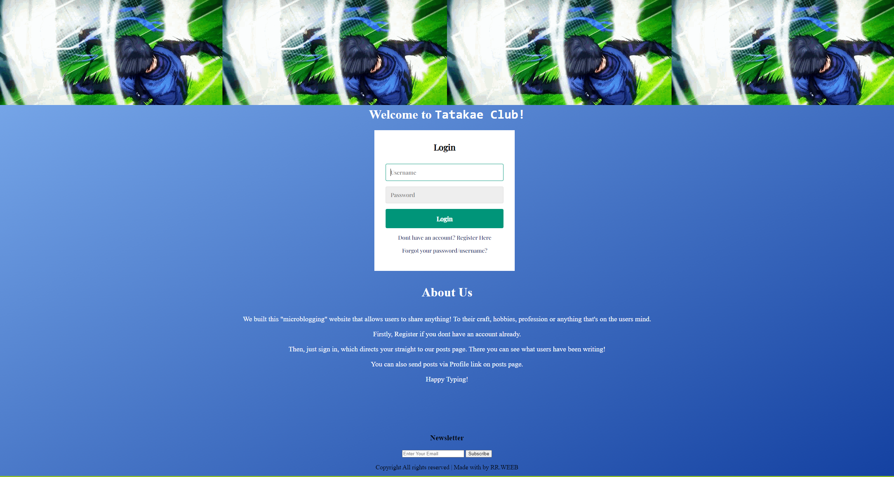
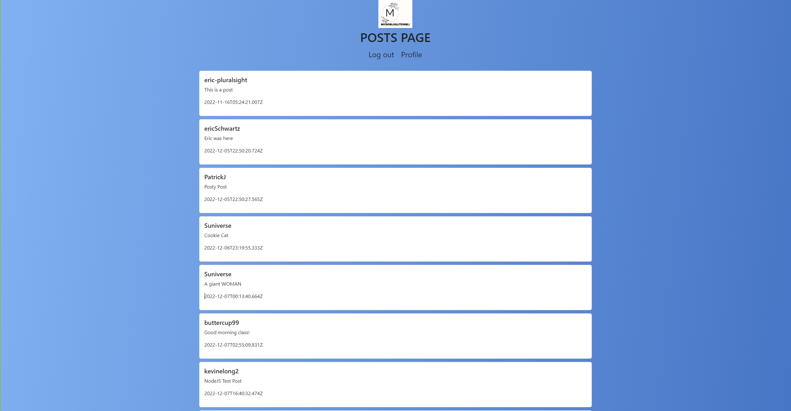
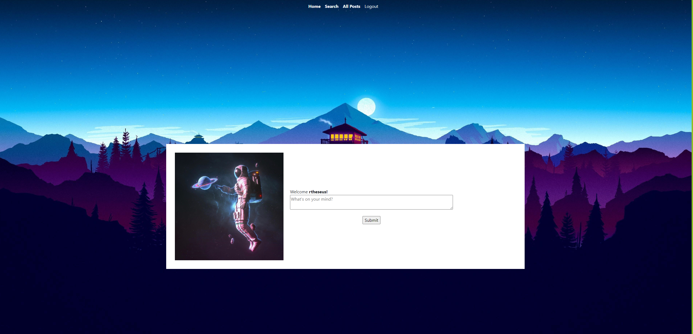
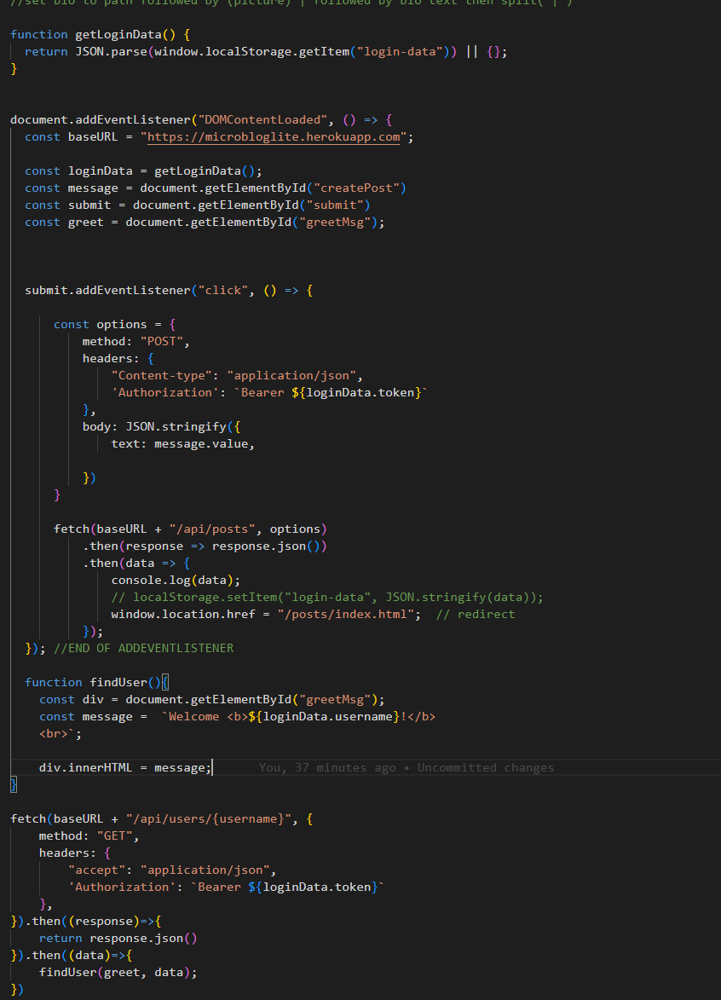

# Capstone3 Enjoy the Microblog Project and the MicroblogLite API!

Don't forget to read the MicroblogLite API docs and experiment with the API in Postman!

Practice and experimentation provide experience, and experience provides confidence.
```
As our final capstone project, we were told to create a blog website that allows uers to share brief insights about their craft
hobbies, profession, and anything that user is thinking about.
```
User, post and login data for this project will be stored on a backend server, designed for this project, called MicroblogLite
https://microbloglite.herokuapp.com/docs/

It will provide visitors with the option to create a user account and new posts. (The MicroblogLite API does not provide functionality for users to follow each other or to comment on posts)

### The app will be a "walled garden". That is, in order to view any user content, a visitor to the website must first log in as a user.









Working on this function was honestly the best part of this project, looking up on how to implment the code together. Working with a partner, it brought that sense of collaboration, trial and error. Long hours on trying to figure out the JavaScript code. In the end 
it brought a big smile to my face.